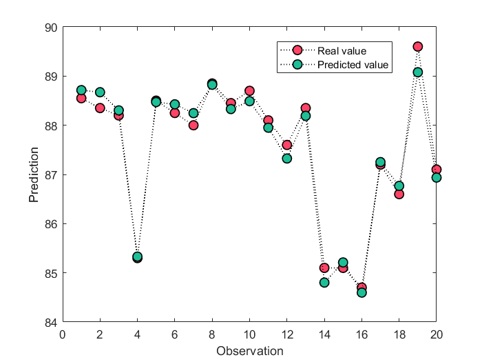
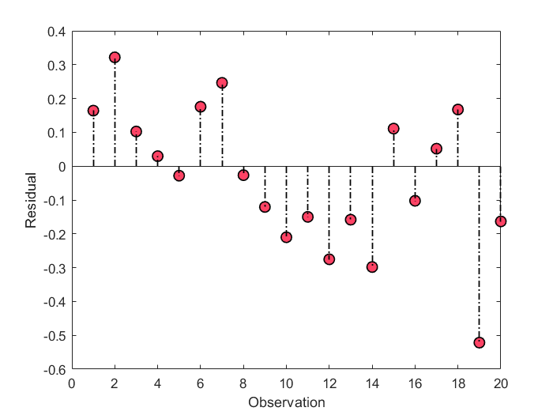

# Partial Least Squares
 Regression using Partial Least Squares (PLS)


## demo

```
clc
close all
addpath(genpath(pwd))

% load data
%{
x :   training inputs
y :   training targets
xt:   testing inputs
yt:   testing targets
%}

load('./data/data.mat')

% train PLS model
model = pls_train(x,y);

% predict the testing targets 
yfit = pls_test(model,xt);

% plot the results
plotResult(yt,yfit)
```

  
